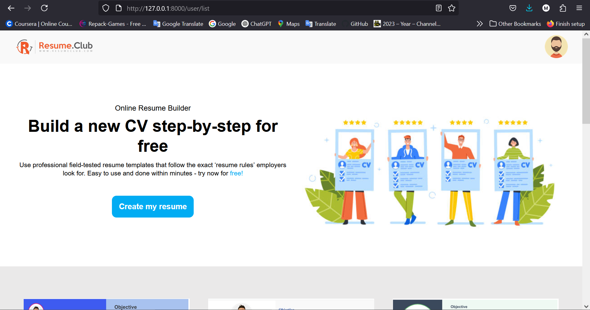
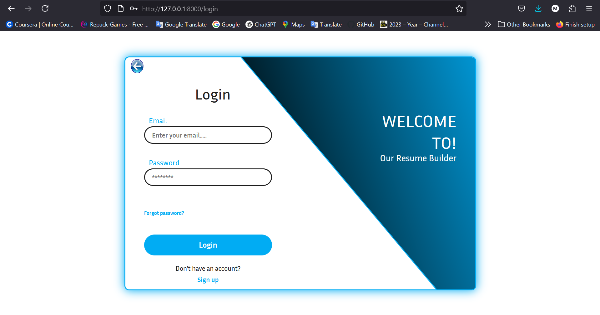
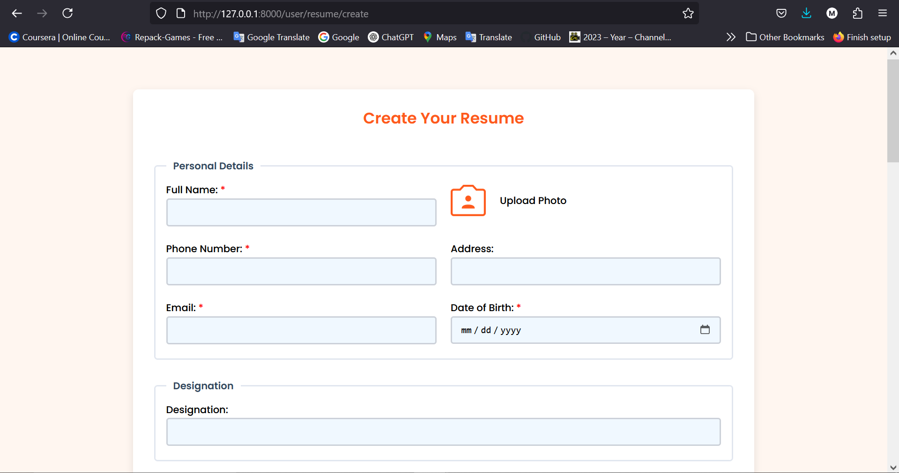
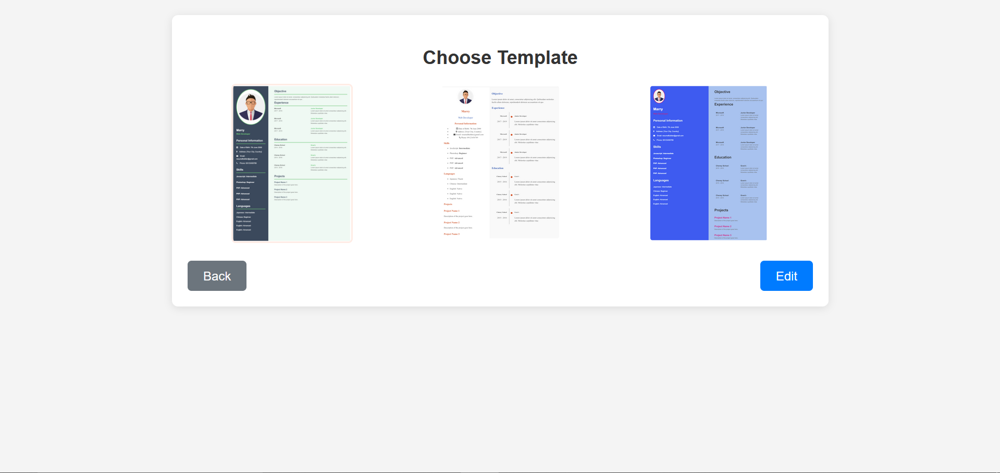
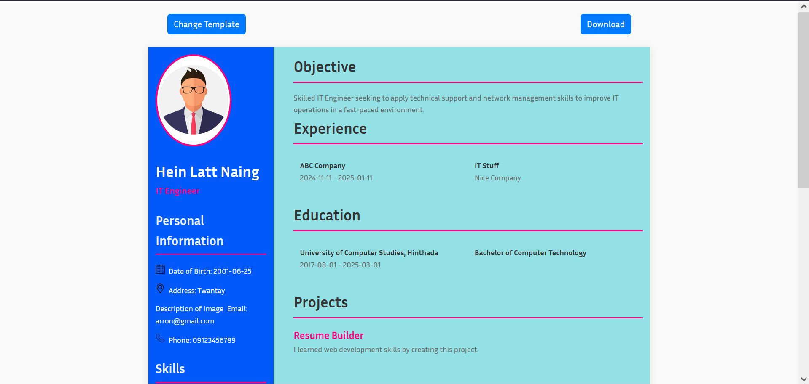

# 📄 Resume Builder (Laravel)

A simple Laravel-based web application that allows users to build, preview, and download resumes quickly.

---

## 🚀 Features

- 📝 Dynamic resume form input
- 📄 Real-time preview of resume details
- 📥 Generate and download PDF version of the resume
- 🧩 Laravel Blade templating
- 🌐 Responsive frontend with pure CSS

---

## 🖼️ Screenshots

###  Homepage


###  Login / Form


###  Data Insert Resume / Form


###  Choose Template


###  Resume Preview


---

## ⚙️ Installation

To run this project locally:

```bash
git clone https://github.com/Arron-Still-Learning/Resume-Builder.git
cd Resume-Builder
composer install
cp .env.example .env
php artisan key:generate
php artisan migrate
php artisan serve
